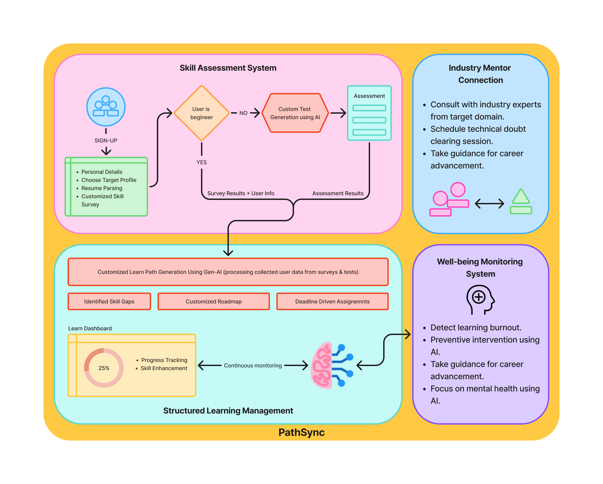

# PathSync: Your Personalized Campus to Career Learning Path
 
<p align="center">
 
[//]: # (  )

</p>
 
<div align="center">
 
[](https://github.com/pathsync-team/pathsync/releases)
[](https://spring.io/projects/spring-boot)
[](https://reactjs.org/)
[](https://www.mongodb.com/)
[](https://opensource.org/licenses/MIT)
 
</div>
 
<h1 align="center">Personalized Learning Paths for Developers 🚀</h1>
 
PathSync is an intelligent learning platform designed to help developers at all levels enhance their skills through personalized learning journeys. By combining skill assessment, adaptive learning, and targeted content recommendations, DevPath creates a customized path for each developer based on their unique strengths, weaknesses, and career goals.
 
## Features
 
- 📋 **Comprehensive Skill Assessment**: Initial survey and technical assessment to accurately gauge your current skill level
- 🎯 **Personalized Learning Paths**: Custom-tailored learning recommendations based on your skill gaps and career goals
- 📚 **Rich Content Library**: Curated high-quality resources including articles, videos, tutorials, and interactive coding exercises
- 📊 **Progress Tracking**: Visual dashboards to monitor your learning journey and skill development
 
[//]: # (- 🏆 **Skill Verification**: Regular challenges and assessments to validate your growing expertise)
- 🧠 **Wellbeing Monitoring**: Track your learning stamina, prevent burnout, and maintain optimal productivity with personalized pace recommendations and break reminders
 
## Screenshots
 
 
## How It Works
 
### 1. Skill Assessment
 
PathSync begins with a comprehensive evaluation of your technical skills:
 
- **Initial Survey**: Share your experience level, preferred technologies, and career goals
- **Adaptive Technical Assessment**: Answer questions that dynamically adjust in difficulty based on your responses
- **Skill Gap Analysis**: Receive a detailed breakdown of your strengths and areas for improvement
 
### 2. Personalized Learning Path Generation
 
Based on your assessment results, PathSync creates a customized learning journey:
 
- **Topic Prioritization**: Focus on the skills most relevant to your goals and current gaps
- **Difficulty Calibration**: Content difficulty matched to your proficiency level
- **Learning Style Adaptation**: Resources aligned with your preferred learning methods
 
[//]: # (### 3. Guided Learning Experience)
 
[//]: # ()
[//]: # (Follow your personalized path with structured support:)
 
[//]: # ()
[//]: # (- **Step-by-Step Progression**: Clear sequence of topics and resources)
 
[//]: # (- **Interactive Challenges**: Apply your knowledge with coding exercises and projects)
 
[//]: # (- **Regular Checkpoints**: Validate your understanding with quizzes and assessments)
 
### 4. Continuous Improvement
 
Your learning path evolves as you grow:
 
- **Progress Tracking**: Visualize your advancement through skills and topics
- **Adaptive Recommendations**: Content suggestions that adjust based on your performance
- **Skill Verification**: Regular opportunities to demonstrate and validate your new abilities
 
## Technology Stack
 
### Backend
- **Framework**: Spring Boot
- **Language**: Java
- **Database**: MongoDB
- **Authentication**: JWT with Spring Security
- **APIs**: RESTful services with Swagger documentation
 
### Frontend
- **Framework**: React with TypeScript
- **State Management**: Redux
- **Styling**: Tailwind CSS
- **UI Components**: Material-UI
- **RoadMap Components**: React Flow for visualizing learning paths
 
## Getting Started
 
### Prerequisites
- Java 17+
- Node.js 16+
- MongoDB 5+\
 
### Local Development Setup
 
1. **Clone the repository**
   ```bash
   git clone https://git.garage.epam.com/panic-at-the-debug/panic-at-the-debug.git
   cd pathsync
   ```
 
2. **Set up the backend**
   ```bash
   cd backend
   ./mvnw spring-boot:run
   ```
 
3. **Set up the frontend**
   ```bash
   cd frontend
   npm install
   npm start
   ```
 
4. **Access the application**
    - Frontend: http://localhost:3000
    - Backend API: http://localhost:8080
    - API Documentation: http://localhost:8080/swagger-ui.html
 
 
## Architecture
 
<details>
<summary>System Architecture (Click to view)</summary>
&nbsp;
 

*High-level overview of PathSync's system architecture*
 
</details>
 
<details>
<summary>Assessment Flow (Click to view)</summary>
&nbsp;
 

*Detailed flow of the skill assessment process*
 
</details>
 
<details>
<summary>Learning Path Generation (Click to view)</summary>
&nbsp;
 

*How personalized learning paths are created*
 
</details>
 
## API Documentation
 
PathSync provides a comprehensive API for integration with other learning systems:
 
- **Authentication API**: User registration, login, and token management
- **Assessment API**: Skill assessment and result analysis
- **Learning Path API**: Generation and management of personalized learning paths
- **Content API**: Access to learning resources and materials
- **Progress API**: Tracking and reporting on user advancement
 
Full API documentation is available at `/swagger-ui.html` when running the application.
 
## Contributing
 
We welcome contributions from the community! Whether it's adding new features, improving documentation, or reporting bugs, your help makes PathSync better for everyone.
 
See [`CONTRIBUTING.md`](docs/CONTRIBUTING.md) for ways to get started.
 
Please adhere to this project's [`CODE_OF_CONDUCT.md`](docs/CODE_OF_CONDUCT.md).
 
## Future Scope
 
    - Enhanced content recommendation algorithm
    - Integration with additional learning resource providers
    - Improved progress analytics
    - Peer learning and mentorship features
    - Industry-specific learning paths
    - Advanced skill certification options
    - AI-powered learning assistant

 
## Our Team
 
PathSync was created by a team of passionate developers and educators who believe in the power of personalized learning:
 
- **Krishnendu Bose** - Backend Developer & Project Lead
- **Shreyansh Rajesh Telrandhe** - Backend Developer
- **Sidhant Guha** - Backend Developer
- **Debarka Chakraborti** - UX/UI Designer & Frontend Developer
 
## Acknowledgments
 
- Thanks to all the content creators and educational platforms that provide valuable learning resources
- Special appreciation to our early users who provided invaluable feedback
- Gratitude to the open-source community for the tools that made this project possible
 
[//]: # (## Contact)
 
[//]: # ()
[//]: # (- **Email**: team@pathsync.io)
 
[//]: # (- **GitHub Issues**: For bug reports and feature requests)
 
---
 
<p align="center">
<i>PathSync: Your journey to becoming a better developer starts here.</i>
</p>
